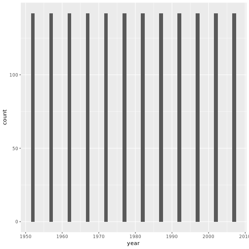
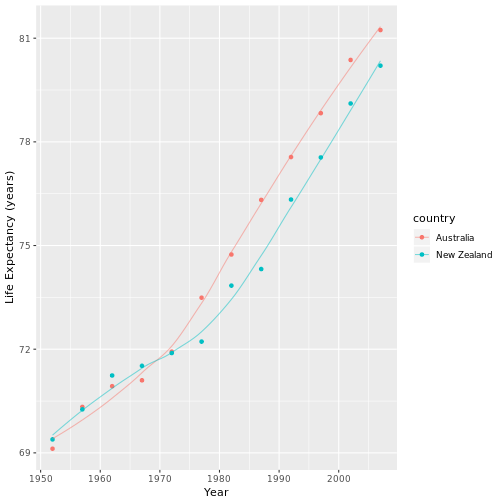
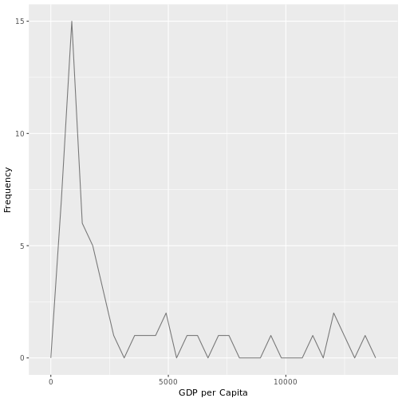
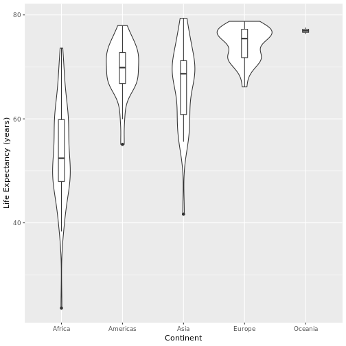

## Smell test the data

### Is it a data.frame, matrix, vector, or list?

From the first line of the default print output, we can see that `gapminder` is a tibble.


```r
gapminder
```

```
## # A tibble: 1,704 x 6
##    country     continent  year lifeExp      pop gdpPercap
##    <fct>       <fct>     <int>   <dbl>    <int>     <dbl>
##  1 Afghanistan Asia       1952    28.8  8425333      779.
##  2 Afghanistan Asia       1957    30.3  9240934      821.
##  3 Afghanistan Asia       1962    32.0 10267083      853.
##  4 Afghanistan Asia       1967    34.0 11537966      836.
##  5 Afghanistan Asia       1972    36.1 13079460      740.
##  6 Afghanistan Asia       1977    38.4 14880372      786.
##  7 Afghanistan Asia       1982    39.9 12881816      978.
##  8 Afghanistan Asia       1987    40.8 13867957      852.
##  9 Afghanistan Asia       1992    41.7 16317921      649.
## 10 Afghanistan Asia       1997    41.8 22227415      635.
## # ... with 1,694 more rows
```

Tibbles are fundamentally lists:


```r
typeof(gapminder)
```

```
## [1] "list"
```

... but they also inherit much of their behaviour from data.frames:


```r
class(gapminder)
```

```
## [1] "tbl_df"     "tbl"        "data.frame"
```

### What is its class?

As seen above, the class of `gapminder` is `tbl_df`, or in other works a tibble dataframe. This class inherits behvaiour from `tbl` (tibble) and data.frame.

### How many variables/columns?


```r
ncol(gapminder)
```

```
## [1] 6
```

There are 6 columns, or variables

### How many rows/observations?


```r
nrow(gapminder)
```

```
## [1] 1704
```

There are 1704 rows, or observations

### Can you get these facts about “extent” or “size” in more than one way? Can you imagine different functions being useful in different contexts?

The `length()` function will also give us the number of columns, because a tibble is effectively a list of column vectors.


```
## [1] 6
```

Conversely, the `dim()` function gives us the number of both columns and rows at once:


```
## [1] 1704    6
```

The first line of the default print function for tibbles also report dimension:

```
## # A tibble: 1,704 x 6
##    country     continent  year lifeExp      pop gdpPercap
##    <fct>       <fct>     <int>   <dbl>    <int>     <dbl>
##  1 Afghanistan Asia       1952    28.8  8425333      779.
##  2 Afghanistan Asia       1957    30.3  9240934      821.
##  3 Afghanistan Asia       1962    32.0 10267083      853.
##  4 Afghanistan Asia       1967    34.0 11537966      836.
##  5 Afghanistan Asia       1972    36.1 13079460      740.
##  6 Afghanistan Asia       1977    38.4 14880372      786.
##  7 Afghanistan Asia       1982    39.9 12881816      978.
##  8 Afghanistan Asia       1987    40.8 13867957      852.
##  9 Afghanistan Asia       1992    41.7 16317921      649.
## 10 Afghanistan Asia       1997    41.8 22227415      635.
## # ... with 1,694 more rows
```

Simple numeric outputs like those of `ncol()`, `nrow()`, and `length()` can be useful in calculations, while prettier outputs like the default print might be nicer for just checking the dimensions while you are working with a dataset.

### What data type is each variable?

The second and third rows of the default print function list the variable names and types.


```
## # A tibble: 1,704 x 6
##    country     continent  year lifeExp      pop gdpPercap
##    <fct>       <fct>     <int>   <dbl>    <int>     <dbl>
##  1 Afghanistan Asia       1952    28.8  8425333      779.
##  2 Afghanistan Asia       1957    30.3  9240934      821.
##  3 Afghanistan Asia       1962    32.0 10267083      853.
##  4 Afghanistan Asia       1967    34.0 11537966      836.
##  5 Afghanistan Asia       1972    36.1 13079460      740.
##  6 Afghanistan Asia       1977    38.4 14880372      786.
##  7 Afghanistan Asia       1982    39.9 12881816      978.
##  8 Afghanistan Asia       1987    40.8 13867957      852.
##  9 Afghanistan Asia       1992    41.7 16317921      649.
## 10 Afghanistan Asia       1997    41.8 22227415      635.
## # ... with 1,694 more rows
```

Accordingly, `country` and `continent` are factors, `year` and `pop` are integers, and `lifeExp` and `gdpPercap` are doubles.


## Explore Individual Variables

I will work with the variables `continent` and `year`.

### What are possible values (or range, whichever is appropriate) of each variable?

These are the 5 possible values for `continent`:


```r
levels(gapminder$continent)
```

```
## [1] "Africa"   "Americas" "Asia"     "Europe"   "Oceania"
```

In contrast, the `year` ranges from 1952 - 2007:


```r
range(gapminder$year)
```

```
## [1] 1952 2007
```

### What values are typical? What’s the spread? What’s the distribution? Etc., tailored to the variable at hand.

Africa is the most common value for `continent`, Oceania the least.

```r
kable(table(gapminder$continent)) #Pass the output of table() into kable() for prettier output
```


|Var1     | Freq|
|:--------|----:|
|Africa   |  624|
|Americas |  300|
|Asia     |  396|
|Europe   |  360|
|Oceania  |   24|

Here are some summary stats for `year` generated using the `summary()` function. Note that since median and mean are the same, the variable has very little skew.

```r
summary(gapminder$year)
```

```
##    Min. 1st Qu.  Median    Mean 3rd Qu.    Max. 
##    1952    1966    1980    1980    1993    2007
```

More specifically, year appears to be uniformly distributed, which makes sense since it is included as an independent variable.


```r
ggplot(gapminder, aes(year)) +
  geom_histogram(binwidth = 1)
```



## Explore various plot types

### How has life expectancy has changed over time in Australia and New Zealand?


```r
gapminder %>%
  filter(continent == 'Oceania') %>% #Only look at Australia and New Zealand
  select(year, country, lifeExp) %>% #Drop the unused variables. Not necessary, but just to say I did use select()
  ggplot(aes(year, lifeExp, colour = country)) + #Note that the colour argument in aes will group the data for us
    geom_point() +
    stat_smooth(geom = "line", alpha = 0.5, se = F) +
    labs(x = "Year", y = "Life Expectancy (years)")
```



### What does the distribution of GDP per capita across Africa look like in 2007?


```r
gapminder %>%
  filter(year == '2007', continent == 'Africa') %>% #Only look at African countries in 2007
  select(gdpPercap) %>% #Once again not necessary
  ggplot(aes(gdpPercap)) + #These graphs only need an x variable
    geom_freqpoly(alpha = 0.5) +
    labs(x = "GDP per Capita", y = "Frequency")
```



### How does life expectancy vary by continent in 1992?


